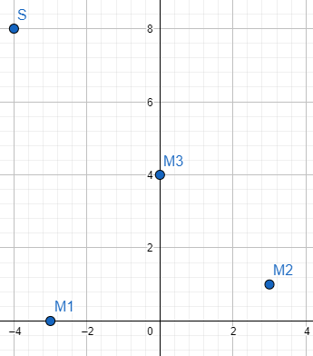
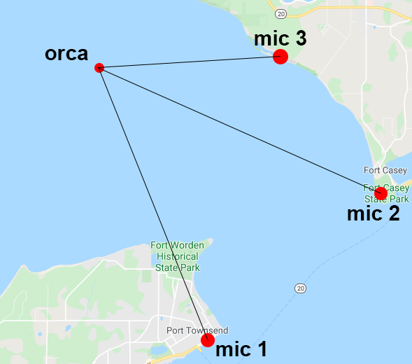

# tdoa-demo
A python program to calculate the source location of a sound signal, derived with 3 microphones and multilateration.

On run the program will ask for an x and y coordinate with a prompt. Right now the coordinates of the microphones are M_0(-3, 0), M_1(3, 1) and M_2(0, 4). The program will then solve for the x and y coordinate prompted. In real life the coordinate is unknown and it would base the location on the TDoA between the microphone. The program is very accurate for source points near the triangle, but will get signifigantly worse as the distance increases. From what I have seen, the direction of the source stays about correct.

This model is loosly based on the geography of Port Townsend, WA, USA:

